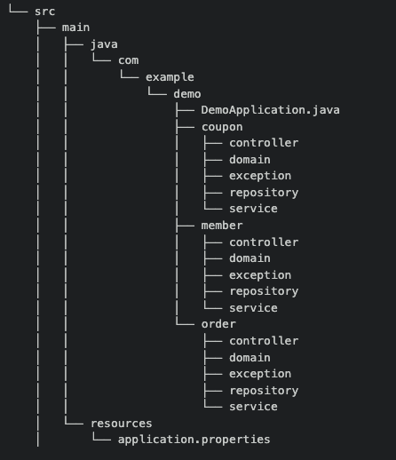

# 📖 Gitbal BackEnd README

 

 
## 팀원 구성

|                       **김효준**                       |                        **이승준**                        |
|:---------------------------------------------------:|:-----------------------------------------------------:|
|  |  |

 

## 1. 개발 환경

- Back-end : Spring, Jpa, 
- 버전 및 이슈관리 : Github, Github Issues
- 협업 툴 : Jira, Notion 
- 서비스 배포 환경 : AWS - EC2 , Docker , Github Actions 사용 예정 
  

## 2. 전략 및 컨벤션

### 브랜치 전략

- Github-flow 전략을 기반으로 main, feature 브랜치를 활용한다
- 브랜치명 : feature/#이슈번호-간단 요약

### 커밋 메시지 컨벤션
- 커밋 메시지 태그 
  - [docs] : 문서작업
  - [feat] : 개발작업
  - [fix] : 오류 나서 수정작업
  - [chore] : 패키지 수정 및 이동
  - [refactor] : 리팩토링 작업
  - [test] : 테스트 코드 관련 작업
- 커밋 메시지 컨벤션 : [태그] #이슈번호 - {작업 내용}

### 이슈 메시지 컨벤션
- 이슈 컨벤션 : 제목 -> [태그] 무슨 작업 진행
- 이슈 내용 컨벤션 : 탬플릿 맞춰서 진행
- ex) `[feat] api 무슨 기능 개발`

### PR 메시지 컨벤션
- pr 제목은 이슈와 동일, 내용은 탬플릿에 맞춰서
- pr 머지 후 브랜치는 삭제

 

## 3. 패키지 구조

### 05.20 기준 도메인형으로 변경!

- 계층형 방식으로 사용하니 응집성이 너무 없어짐
- 한 서비스에 너무 많은 클래스가 있는 구조가 더 혼란스럽다고 판단

.

